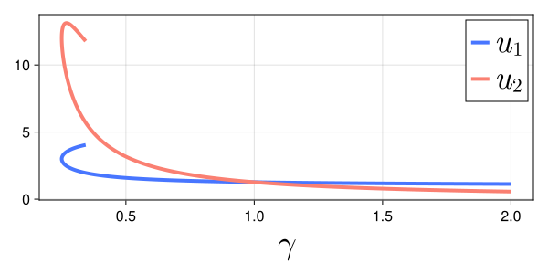

# Pseudo-arclength continuation of equilibria of the FitzHugh-Nagumo model

In this example, we will prove the existence of a branch of equilibria of the FitzHugh-Nagumo model

```math
\begin{cases}
\displaystyle \frac{d}{dt} u(t) = f(u(t), \gamma) \bydef \begin{pmatrix} u_1(t)(u_1(t) - a)(1 - u_1(t)) - u_2(t) \\ \varepsilon(u_1(t) - \gamma u_2(t)) \end{pmatrix},\\
u(0) = u_0 \in \mathbb{R}^2,
\end{cases}
```

where ``a = 5`` and ``\varepsilon = 1``.

The vector-field ``f`` and its Jacobian, denoted ``Df``, may be implemented as follows:

```@example fhn_pseudo_arclength
function f(u, γ)
    a, ϵ = 5, 1
    u₁, u₂ = u
    return [u₁*(u₁ - a)*(1 - u₁) - u₂, ϵ*(u₁ - γ*u₂)]
end

function Dᵤf(u, γ)
    a, ϵ = 5, 1
    u₁, u₂ = u
    return [a*(2u₁-1)+(2-3u₁)*u₁ -1
            ϵ                    -ϵ*γ]
end

function ∂γf(u, γ)
    a, ϵ = 5, 1
    u₁, u₂ = u
    return [0, -ϵ*u₂]
end
nothing # hide
```

We use the [pseudo-arclength continuation](https://en.wikipedia.org/wiki/Numerical_continuation#Pseudo-arclength_continuation) and retrieve a numerical approximation of the curve. By a contraction argument, we then prove that there exists a surrounding region that contains the desired curve.

In a nutshell, the pseudo-arclength continuation consists in computing a sequence of numerical zeros of ``f``. Starting with an initial approximate zero ``x_\text{init} \in \mathbb{R}^3``, we retrieve an approximate tangent vector ``v`` to the curve at ``x_\text{init}`` by looking at ``\ker Df(x_\text{init})``. Then, our predictor for the next zero is set to ``w \bydef x_\text{init} + \delta v`` where ``\delta > 0`` represents the step size. The Newton's method is applied on the mapping ``F_\text{Newton} : \mathbb{R}^3 \to \mathbb{R}^3`` given by

```math
F_\text{Newton}(x) \bydef
\begin{pmatrix}
f(x) \\
(x - w) \cdot v
\end{pmatrix}.
```

The mapping ``F_\text{Newton}`` and its Jacobian may be implemented as follows:

```@example fhn_pseudo_arclength
import LinearAlgebra: ⋅

F(x, v, w) = [f(x[1:2], x[3]) ; (x - w) ⋅ v]

DF(x, v) = [Dᵤf(x[1:2], x[3]) ∂γf(x[1:2], x[3]) ; transpose(v)]
nothing # hide
```

Next, we perform Newton's method:

```@example fhn_pseudo_arclength
using RadiiPolynomial
import LinearAlgebra: nullspace

# initial point on the branch of equilibria

γ_init = 2.0

u_init = [1.1, 0.5]
u_init, success = newton(u -> (f(u, γ_init), Dᵤf(u, γ_init)), u_init)

# next point on the branch of equilibria

x_init = [u_init ; γ_init]

v = vec(nullspace([Dᵤf(x_init[1:2], x_init[3]) ∂γf(x_init[1:2], x_init[3])])) # initial tangent vector

δ = 5e-2 # step size

w = x_init + δ * v # predictor

x_final, success = newton(x -> (F(x, v, w), DF(x, v)), w)
nothing # hide
```

Whenever Newton's method is successful, we proceed to the next iteration of the pseudo-arclength continuation by repeating the above strategy. Performing this sufficiently many times, we can construct an order ``N`` polynomial approximation of the curve of zeros:

```math
\bx(s) \bydef \bx_0 + 2 \sum_{n = 1}^N \bx_n \phi_n (s), \qquad \text{for all } s \in [-1,1],
```

where ``\phi_n`` are the [Chebyshev polynomials of the first kind](https://en.wikipedia.org/wiki/Chebyshev_polynomials).

Define the mapping ``F : \mathbb{R}^3 \times [-1,1] \to \mathbb{R}^3`` by

```math
F(x, s) \bydef
\begin{pmatrix}
f(x) \\
(x - \bx(s)) \cdot \bar{v}(s)
\end{pmatrix},
```

and the fixed-point operator ``T : \mathbb{R}^3 \times [-1,1] \to \mathbb{R}^3`` by

```math
T(x, s) \bydef x - A(s) F(x, s),
```

where ``A(s) : \mathbb{R}^3 \to \mathbb{R}^3`` is the injective operator corresponding to a numerical approximation of ``D_x F(\bx(s), s)^{-1}`` for all ``s \in [-1, 1]``.

Let ``R > 0``. We use a uniform version of the second-order Radii Polynomial Theorem (cf. Section [Radii polynomial approach](@ref radii_polynomial_approach)) such that we need to estimate ``\|T(\bx(s), s) - \bx(s)\|_1``, ``\|D_x T(\bx(s), s)\|_1`` and ``\sup_{x \in \text{cl}( B_R(\bx(s)) )} \|D_x^2 T(x, s)\|_1`` for all ``s \in [-1,1]``. In particular, we have

```math
\|T(\bx(s), s) - \bx(s)\|_1 = \left\|A(s) \begin{pmatrix} f(\bx(s)) \\ 0 \end{pmatrix} \right\|_1, \qquad \text{for all } s \in [-1,1].
```

The computer-assisted proof may be implemented as follows:

```@example fhn_pseudo_arclength
N = 700
N_fft = nextpow(2, 2N + 1)
npts = N_fft ÷ 2 + 1

arclength = 15.0
arclength_grid = [0.5 * arclength - 0.5 * cospi(2j/N_fft) * arclength for j ∈ 0:npts-1]
x_grid = Vector{Vector{Float64}}(undef, npts)
v_grid = Vector{Vector{Float64}}(undef, npts)

# initialize

direction = [0, 0, -1] # starts by decreasing the parameter
x_grid[1] = x_init
v_grid[1] = vec(nullspace([Dᵤf(x_grid[1][1:2], x_grid[1][3]) ∂γf(x_grid[1][1:2], x_grid[1][3])]))
if direction ⋅ v_grid[1] < 0 # enforce direction
    v_grid[1] .*= -1
end

# run continuation scheme

for i ∈ 2:npts
    δᵢ = arclength_grid[i] - arclength_grid[i-1]

    wᵢ = x_grid[i-1] .+ δᵢ .* v_grid[i-1]

    x, success = newton(x -> (F(x, v_grid[i-1], wᵢ), DF(x, v_grid[i-1])), wᵢ; verbose = true)
    success || error()

    x_grid[i] = x
    v_grid[i] = vec(nullspace([Dᵤf(x_grid[i][1:2], x_grid[i][3]) ∂γf(x_grid[i][1:2], x_grid[i][3])]))
    if v_grid[i-1] ⋅ v_grid[i] < 0 # keep the same direction
        v_grid[i] .*= -1
    end
end

# construct the approximations

grid2cheb(x_fft::Vector{<:Vector}, N) =
    [rifft!(complex.(getindex.(x_fft, i)), Chebyshev(N)) for i ∈ eachindex(x_fft[1])]

grid2cheb(x_fft::Vector{<:Matrix}, N) =
    [rifft!(complex.(getindex.(x_fft, i, j)), Chebyshev(N)) for i ∈ axes(x_fft[1], 1), j ∈ axes(x_fft[1], 2)]

x_fft = [reverse(x_grid) ; x_grid[begin+1:end-1]]
x̄ = map(x -> interval.(x), grid2cheb(x_fft, N))

v_fft = [reverse(v_grid) ; v_grid[begin+1:end-1]]
v̄ = map(v -> interval.(v), grid2cheb(v_fft, N))

A = map(A -> interval.(A), grid2cheb(inv.(DF.(x_fft, v_fft)), N))

# compute the bounds

function cheb2grid(x::VecOrMat{<:Sequence}, N_fft)
    vals = fft.(x, N_fft)
    return [real.(getindex.(vals, i)) for i ∈ eachindex(vals[1])]
end

# AF is a polynomial with respect to s of order 4N

N4 = 4N
N4_fft = nextpow(2, 2N4 + 1)

AF_fft = cheb2grid(A, N4_fft) .* F.(cheb2grid(x̄, N4_fft), cheb2grid(v̄, N4_fft), cheb2grid(x̄, N4_fft))
AF = grid2cheb(AF_fft, N4)

Y = norm(norm.(AF, 1), 1)

# ADF is a polynomial with respect to s of order 3N

N3 = 3N
N3_fft = nextpow(2, 2N3 + 1)

I_ADF_fft = [I] .- cheb2grid(A, N3_fft) .* DF.(cheb2grid(x̄, N3_fft), cheb2grid(v̄, N3_fft))
I_ADF = grid2cheb(I_ADF_fft, N3)

Z₁ = opnorm(norm.(I_ADF, 1), 1)

#

R = 1.2sup(Y)

a, ϵ = 5, 1
Z₂ = opnorm(norm.(A, 1), 1) * max(abs(2a + 2) + 6(norm(x̄[1], 1) + R) + abs(ϵ), abs(ϵ))

#

setdisplay(:full)

interval_of_existence(Y, Z₁, Z₂, R)
```

The following figure[^1] shows the numerical approximation of the proven branch of equilibria of the FitzHugh-Nagumo model.

[^1]: S. Danisch and J. Krumbiegel, [Makie.jl: Flexible high-performance data visualization for Julia](https://doi.org/10.21105/joss.03349), *Journal of Open Source Software*, **6** (2021), 3349.


