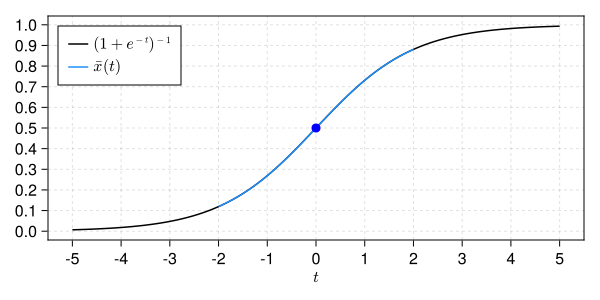

# Initial value problem of the logistic equation

In this example, we will prove the existence of a solution of the logistic equation

```math
\begin{cases}
\displaystyle \frac{d}{dt} u(t) = f(u(t)) := u(t)(1 - u(t)),\\
u(0) = 1/2.
\end{cases}
```

Let ``\nu > 0``,

```math
X := \left\{ \{ x_\alpha \}_{\alpha \ge 0} \in \mathbb{R}^{\mathbb{N} \cup \{0\}} \, : \, | x |_X := \sum_{\alpha \ge 0} |x_\alpha| \nu^\alpha < +\infty \right\}
```

and ``* : X \times X \to X`` be the Cauchy product given by

```math
x * y := \left\{ \sum_{\beta = 0}^\alpha x_{\alpha - \beta} y_\beta \right\}_{\alpha \ge 0}, \qquad \text{for all } x, y \in X.
```

For any sequence ``x \in X``, the Taylor series ``\sum_{\alpha \ge 0} x_\alpha t^\alpha`` defines an analytic function in ``C^\omega([-\nu, \nu], \mathbb{R})``; while the Cauchy product ``*`` corresponds to the product of Taylor series in sequence space.

The Banach space ``X`` is a suitable space to represent a solution of the logistic equation. Indeed, it is a standard result from ODE theory that analytic vector fields yield analytic solutions.[^1]

[^1]: A. Hungria, J.-P. Lessard and J. D. Mireles James, [Rigorous numerics for analytic solutions of differential equations: the radii polynomial approach](https://doi.org/10.1090/mcom/3046), *Mathematics of Computation*, **85** (2016), 1427-1459.

It follows that the sequence of coefficients of a Taylor series solving the initial value problem is a zero of the mapping ``F : X \to X`` given component-wise by

```math
( F(x) )_\alpha :=
\begin{cases}
x_0 - 1/2, & \alpha = 0,\\
\alpha x_\alpha - (x*(1 - x))_{\alpha-1}, & \alpha \ge 1.
\end{cases}
```

The mapping ``F`` and its Fréchet derivative, denoted ``DF``, may be implemented as follows:

```@example logistic_ivp
using RadiiPolynomial

function F!(F, x)
    F[0] = x[0] - 0.5

    v = differentiate(x) - x*(1 - x)
    for α ∈ 1:order(F)
        F[α] = v[α-1]
    end

    return F
end

function DF!(DF, x)
    DF .= 0

    DF[0,0] = 1

    DF[1:end,:] .= Derivative(1) - project(Multiplication(1 - 2x), domain(DF), Taylor(order(codomain(DF))-1))

    return DF
end
nothing # hide
```

Consider the fixed-point operator ``T : X \to X`` defined by

```math
T(x) := x - A F(x),
```

where ``A : X \to X`` is an injective operator corresponding to an approximation of ``DF(\bar{x})^{-1}`` for some numerical zero ``\bar{x} \in X`` of ``F``.

Given an initial guess, the numerical zero ``\bar{x}`` of ``F`` may be obtained by Newton's method:

```@example logistic_ivp
n = 27

x̄ = Sequence(Taylor(n), zeros(n+1))

x̄, success = newton!((F, DF, x) -> (F!(F, x), DF!(DF, x)), x̄)
nothing # hide
```

Let ``R > 0``. Since ``T \in C^2(X, X)`` we may use the [second-order Radii Polynomial Theorem with ``C^2`` condition](@ref C2_condition_RPT) such that we need to estimate ``|T(\bar{x}) - \bar{x}|_X``, ``|DT(\bar{x})|_{\mathscr{B}(X, X)}`` and ``\sup_{x \in \text{cl}( B_R(\bar{x}) )} |D^2T(x)|_{\mathscr{B}(X^2, X)}``.

To this end, consider the truncation operator

```math
(\pi^n x)_\alpha :=
\begin{cases} x_\alpha, & \alpha \le n,\\
0, & \alpha > n,
\end{cases} \qquad \text{for all } x \in X,
```

as well as the complementary operator ``\pi^{\infty(n)} := I - \pi^n``.

Thus, we have

```math
\begin{aligned}
|T(\bar{x}) - \bar{x}|_X &\le |\pi^n A \pi^n F(\bar{x})|_X + \frac{1}{n+1} |\pi^{\infty(n)} F(\bar{x})|_X,\\
|DT(\bar{x})|_{\mathscr{B}(X, X)} &\le |\pi^n A \pi^n DF(\bar{x}) \pi^n - \pi^n|_{\mathscr{B}(X, X)} + \frac{\nu}{n+1} |2\bar{x} - 1|_X,\\
\sup_{x \in \text{cl}( B_R(\bar{x}) )} |D^2T(x)|_{\mathscr{B}(X^2, X)} &\le 2 \nu \left( |\pi^n A \pi^n|_{\mathscr{B}(X, X)} + \frac{1}{n+1} \right).
\end{aligned}
```

In particular, from the latter estimate, we may freely choose ``R = \infty``.

The computer-assisted proof may be implemented as follows:

```@example logistic_ivp
ν = Interval(2.0)
X = ℓ¹(GeometricWeight(ν))
R = Inf

x̄_interval = Interval.(x̄)

F_interval = Sequence(Taylor(2n+1), similar(coefficients(x̄_interval), 2n+2))
F!(F_interval, x̄_interval)

tail_F_interval = copy(F_interval)
tail_F_interval[0:n] .= Interval(0.0)

DF_interval = LinearOperator(Taylor(n), Taylor(n), similar(coefficients(x̄_interval), n+1, n+1))
DF!(DF_interval, x̄_interval)

A = inv(mid.(DF_interval))
bound_tail_A = inv(Interval(n+1))

# computation of the bounds

Y = norm(A * F_interval, X) + bound_tail_A * norm(tail_F_interval, X)

Z₁ = opnorm(A * DF_interval - I, X) + bound_tail_A * ν * norm(2x̄_interval - 1, X)

Z₂ = 2ν * (opnorm(Interval.(A), X) + bound_tail_A)

showfull(interval_of_existence(Y, Z₁, Z₂, R, C²Condition()))
```

The following figure[^2] shows the numerical approximation of the proven solution in the interval ``[-2, 2]`` along with the theoretical solution ``t \mapsto (1 + e^{-t})^{-1}``.

[^2]: S. Danisch and J. Krumbiegel, [Makie.jl: Flexible high-performance data visualization for Julia](https://doi.org/10.21105/joss.03349), *Journal of Open Source Software*, **6** (2021), 3349.


