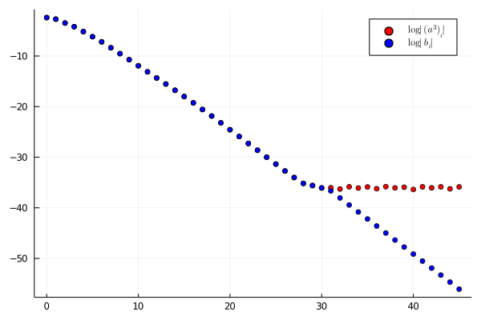

# Sequences

A [`Sequence`](@ref) is a structure representing an element of a [`SequenceSpace`](@ref), that is it corresponds to a compactly supported sequence. The coefficients of a [`Sequence`](@ref) are organized according to the space indexing.

## Arithmetic

The arithmetic operations `+,-,*,^` are implemented along with the convenient *bar operations* `+̄,-̄,*̄,^̄` (`+\bar<TAB>, -\bar<TAB>, *\bar<TAB>, ^\bar<TAB>`) which are equivalent to

```julia
+̄(a::Sequence...) = project(+(a...), mapreduce(aᵢ -> aᵢ.space, ∪̄, a))
-̄(a::Sequence...) = project(-(a...), mapreduce(aᵢ -> aᵢ.space, ∪̄, a))
*̄(a::Sequence...) = project(*(a...), mapreduce(aᵢ -> aᵢ.space, ∪̄, a))
^̄(a::Sequence, n::Int) = project(^(a, n), a.space)
```

!!! note
    Divisions between sequences and other elementary functions (e.g. `exp,log,cos,sin`)
    are purposely not supported as, in general, they yield sequences which are not compactly supported.

```@repl
using RadiiPolynomial
a = Sequence(Fourier(1, 1.0) ⊗ Taylor(2), [0.5, 0.0, 0.5, 0.0, 0.0, 0.0, 0.0, 1.0, 0.0]) # a(x,y) = cos(x) + y^2
a^2 # a(x,y)^2 = cos^2(x) + 2cos(x)y^2 + y^4
```

The internal routines of the multiplication are based on the fast Fourier transform (FFT) which needed to be re-implemented to ensure compatibility with [IntervalArithmetic.jl](https://github.com/JuliaIntervals/IntervalArithmetic.jl). It is important to keep in mind that the interval representation widens severely with complex number multiplication which conflicts with the FFT algorithm. This has been taken into account by implementing `*(a::Sequence, b::Sequence, c::Sequence...)` such that we only perform the FFT algorithm twice.

```@repl
using RadiiPolynomial, IntervalArithmetic
space = Taylor(2^12-1)
a = Sequence(space, [@interval(x) for x ∈ rand(length(space))])
maximum(radius.(a))
maximum(radius.(a^3))
maximum(radius.(a^5))
```

The above shows a considerable loss of accuracy. Although, in practice series exhibit a decay which prevents such a large error to occur. Indeed, if we add a small decay to our series:

```@repl
using RadiiPolynomial, IntervalArithmetic
space = Taylor(2^12-1)
a = Sequence(space, [@interval(rand()/4.0^i) for i ∈ eachindex(space)])
maximum(radius.(a^5))
```

!!! note
    The intervals precision can be adjusted via `setprecision` (cf. [IntervalArithmetic.jl](https://github.com/JuliaIntervals/IntervalArithmetic.jl)).

However, in [Computing Discrete Convolutions with Verified Accuracy Via Banach Algebras and the FFT](https://link.springer.com/article/10.21136/AM.2018.0082-18) the author shows how to rigorously bound convolutions to avoid machine precision limitations. The algorithm can be used via the [`banach_algebra_rounding!`](@ref) function.

```@repl
using RadiiPolynomial, IntervalArithmetic
space = Taylor(2^4-1);
a = Sequence(space, [@interval(rand()/4.0^i) for i ∈ eachindex(space)]);
C = norm(a, 4.0)^3;
ν = [@interval(C/4.0^i) for i ∈ 0:3order(space)];
a³ = a^3;
b = banach_algebra_rounding!(a^3, ν);
```


